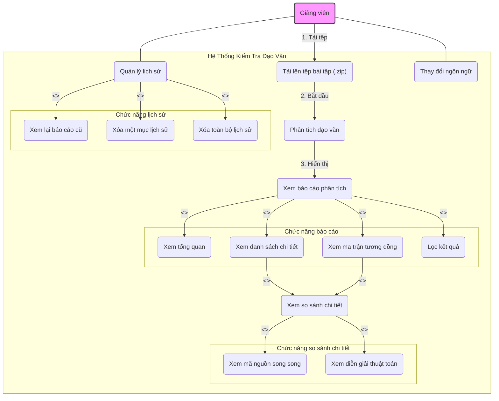

# Sơ Đồ Use Case - Hệ Thống Kiểm Tra Đạo Văn Code

Tài liệu này mô tả các trường hợp sử dụng (Use Case) chính của hệ thống, thể hiện sự tương tác giữa người dùng (Giảng viên) và các chức năng của ứng dụng.

## Hướng dẫn sử dụng với Draw.io (Diagrams.net)

Đoạn mã bên dưới được viết bằng cú pháp **Mermaid**. Bạn có thể nhập trực tiếp vào công cụ draw.io để tạo và chỉnh sửa sơ đồ một cách trực quan.

1.  Sao chép toàn bộ nội dung trong khối mã bên dưới.
2.  Truy cập [https://app.diagrams.net/](https://app.diagrams.net/).
3.  Đi tới menu: **Arrange** > **Insert** > **Advanced** > **Mermaid...** (Hoặc **Sắp xếp** > **Chèn** > **Nâng cao** > **Mermaid...**).
4.  Dán nội dung bạn đã sao chép vào hộp thoại.
5.  Nhấn **Insert**. Sơ đồ sẽ được tự động vẽ ra.

## Sơ Đồ

## Mô Tả Chi Tiết

### 1. Tác nhân (Actor)

*   **Giảng viên**: Người dùng chính của hệ thống, thực hiện việc tải lên, phân tích và xem kết quả đạo văn.

### 2. Các Use Case

| ID | Use Case | Mô Tả |
| :--- | :--- | :--- |
| **UC1** | Tải lên tệp bài tập | Giảng viên chọn và tải lên một tệp nén (`.zip`, `.rar`) chứa các tệp mã nguồn của sinh viên. |
| **UC2** | Phân tích đạo văn | Sau khi tệp được tải lên, giảng viên yêu cầu hệ thống bắt đầu quá trình so sánh và phân tích đạo văn giữa các tệp. |
| **UC3** | Xem báo cáo phân tích | Hệ thống hiển thị một báo cáo tổng quan sau khi phân tích xong. Bao gồm:   - **UC3.1**: Thống kê tổng quan (tổng số bài, số cặp nghi ngờ).   - **UC3.2**: Danh sách chi tiết các cặp tệp được so sánh cùng độ tương đồng.   - **UC3.3**: Ma trận tương đồng trực quan.   - **UC3.4**: Chức năng lọc kết quả theo ngưỡng tương đồng. |
| **UC4** | Xem so sánh chi tiết | Từ danh sách hoặc ma trận, giảng viên có thể chọn một cặp tệp cụ thể để xem so sánh sâu hơn. Bao gồm:   - **UC4.1**: So sánh mã nguồn song song.   - **UC4.2**: Đọc diễn giải chi tiết về các bước của thuật toán. |
| **UC5** | Quản lý lịch sử | Giảng viên có thể quản lý lịch sử các lần phân tích đã thực hiện. Bao gồm:   - **UC5.1**: Mở lại một báo cáo đã phân tích trước đây.   - **UC5.2**: Xóa một mục cụ thể khỏi lịch sử.   - **UC5.3**: Xóa toàn bộ lịch sử phân tích. |
| **UC6** | Thay đổi ngôn ngữ | Giảng viên có thể chuyển đổi giao diện giữa Tiếng Việt và Tiếng Anh. |
