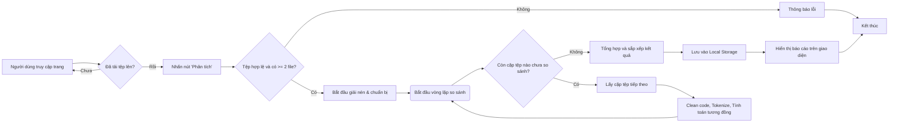

# Sơ đồ hoạt động hệ thống (Mermaid)

Bạn có thể sao chép đoạn mã bên dưới và nhập vào công cụ draw.io (diagrams.net) để tạo và chỉnh sửa sơ đồ một cách trực quan.

1.  Sao chép toàn bộ nội dung trong khối mã bên dưới.
2.  Truy cập [https://app.diagrams.net/](https://app.diagrams.net/).
3.  Đi tới menu: **Arrange** > **Insert** > **Advanced** > **Mermaid...** (Hoặc **Sắp xếp** > **Chèn** > **Nâng cao** > **Mermaid...**).
4.  Dán nội dung bạn đã sao chép vào hộp thoại.
5.  Nhấn **Insert**. Sơ đồ sẽ được tự động vẽ ra.

