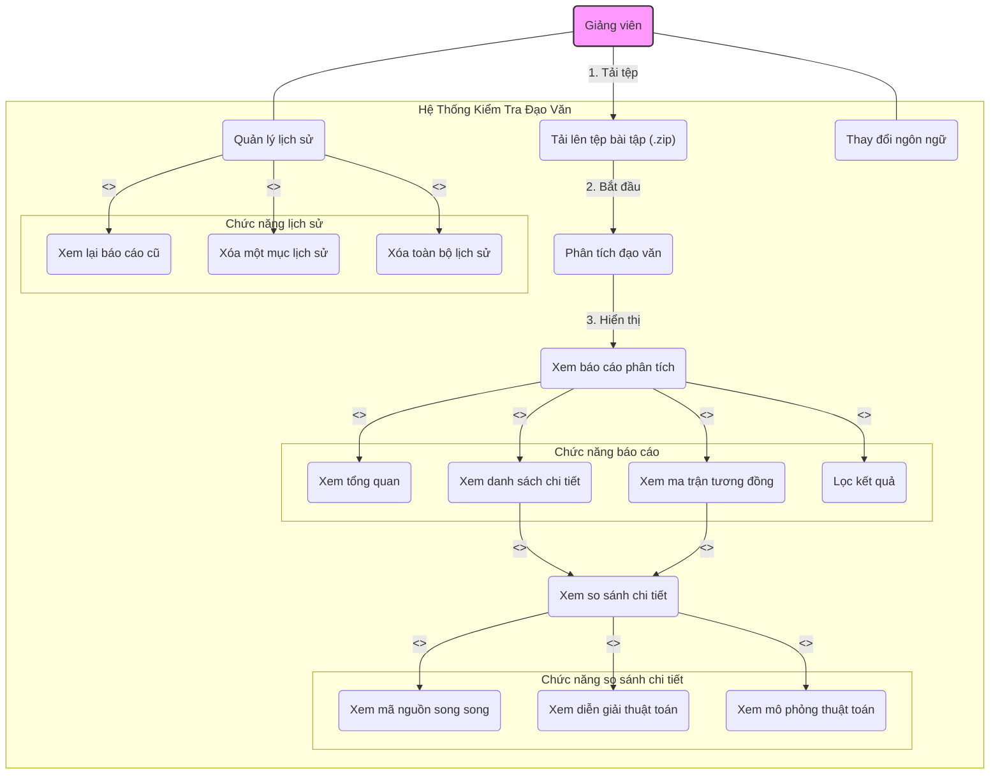

# Sơ Đồ Use Case - Hệ Thống Kiểm Tra Đạo Văn Code

Tài liệu này mô tả các trường hợp sử dụng (Use Case) chính của hệ thống, thể hiện sự tương tác giữa người dùng (Giảng viên) và các chức năng của ứng dụng.

## Hướng dẫn sử dụng với Draw.io (Diagrams.net)

Đoạn mã bên dưới được viết bằng cú pháp **Mermaid**. Bạn có thể nhập trực tiếp vào công cụ draw.io để tạo và chỉnh sửa sơ đồ một cách trực quan.

1.  Sao chép toàn bộ nội dung trong khối mã bên dưới.
2.  Truy cập [https://app.diagrams.net/](https://app.diagrams.net/).
3.  Đi tới menu: **Arrange** > **Insert** > **Advanced** > **Mermaid...** (Hoặc **Sắp xếp** > **Chèn** > **Nâng cao** > **Mermaid...**).
4.  Dán nội dung bạn đã sao chép vào hộp thoại.
5.  Nhấn **Insert**. Sơ đồ sẽ được tự động vẽ ra.

## Mã nguồn sơ đồ Mermaid

